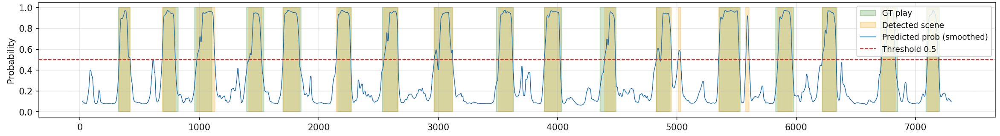
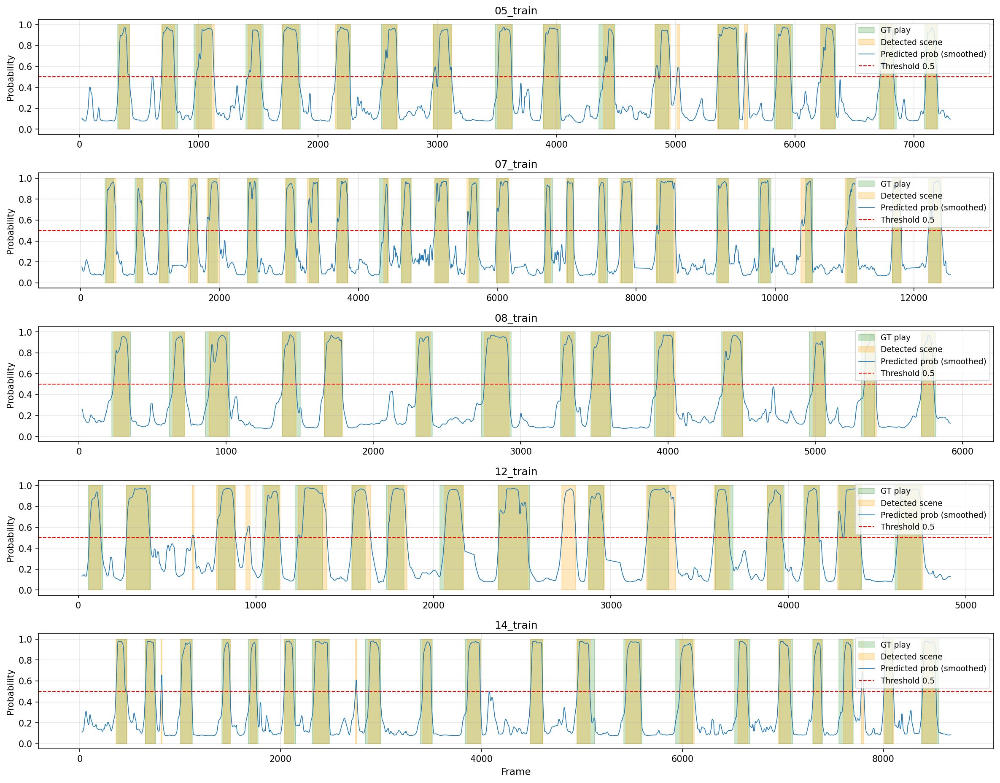

趣味で卓球をやっているのですが、卓球の試合映像からプレーシーンを検出するMLモデルを作成しました。

## どんなもの？
卓球の試合映像を入力したら、ラリーをしている時間（プレー中）だけを検出してくれるモデルです。You Only Look Once (YOLO) と Long Short-Term Memory (LSTM) を組み合わせて作成しました。\
　[Visuable for You](https://visualize-tt.com/) という Web アプリケーションとしても公開しており、メールアドレス登録で誰でも無料で利用できます。
コードは [GitHub](https://github.com/TakuM-M/Visuable_for_you_tabletennis) に公開しています。

## 開発背景
私はよく試合の見返しや反省のために自身のプレー映像を撮影しています。撮影した映像からは、フォームの確認や戦術の分析など、振り返ることによって得られることが多くあり、競技レベル向上には欠かせない作業です。しかし、試合数を重ねるごとに、映像の量が増えてスマートフォンからの削除や振り返り自体の負担などが大きくなりがちです。

卓球界のレジェンドである荻村伊智朗氏は、かつて「卓球は100メートルを全力疾走しながらチェスをするようなスポーツだ」という言葉を残しています。
この言葉が示すように、卓球は一瞬の全力運動と、その合間の戦術判断によって勝敗が決まるスポーツです。
裏を返せば、試合映像のうち実際にラリーが行われている時間はごくわずか、とも言えます。

fig1 は、今回実際に作成したモデルを用いてある試合映像に対して各フレームがプレー中かどうかを判定した結果です。緑の帯が私がラベル付けをした実際のプレー区間を示します。

fig1 からもわかるように、卓球というスポーツの試合映像は元々プレー中の時間は短く、むしろプレーをしていない時間（タオルで体を拭く時間、サーブを構える前の思考時間、ボールを拾う時間 etc...）の方が多くを占めています。データとしては正解ラベル（今回だとプレー中）が少ない「不均衡なデータ」とも言えます。そこで、試合映像の中でプレーシーンを検出することができれば、映像の容量も振り返りの負担も大幅に減らせるのではないかと考えました。

## 特徴量の選択

この「卓球の試合映像からプレーシーンを検出する」というタスクは、抽象的に捉えると「映像の中から特定のシーンである確率を予測する二値分類タスク」と言えます。モデルは映像の中から特定のシーンであるということを予測できれば良いのです。

では、映像の中から「卓球のプレーシーンである確率」を予測するためにはどのような手法が考えられるでしょうか。当初は以下二つの手法を検討しました。

1. **映像全体を入力とした二値分類予測**  
    CNN, RNN のようなモデルを用いて、映像全体を入力として「プレーシーンであるかどうか」を予測する方法です。CNN なら各フレームごとに特徴量を抽出して複数のフレームから特徴量を統合することで、映像全体の特徴量を抽出できます。RNN なら時系列データとして映像を扱い、フレームごとの特徴量を順番に入力することで、映像全体の特徴量を抽出できます。
2. **YOLOを用いた卓球ボールの検出**  
    YOLO は物体検出タスクにおいて非常に優れたモデルです。ファインチューニングも容易で、少ないデータでも学習が可能です。YOLO を用いて卓球ボールを検出することで、ボールが動いているか止まっているかを判定し、プレーシーンであるかを確率として予測することができます。

しかし、1 の方法は映像を入力として扱うと計算量がボトルネックになる点、またアマチュア層は撮影画角が安定しない（体育館が狭い、三脚の設置が難しい）ため、予測精度への不安があるなどの問題がありました。2 の方法にも、卓球ボールの検出には撮影時に高 fps が必要となる点、高速で動く卓球ボール自体の検出が難しい点といった問題がありました。

そこで今回は、**「人間の骨格」** という特徴量に注目しました。選手の姿は映像内で大きな面積を占めており、また卓球のプレー中の骨格は特徴的な動きを示すため、プレーシーンを判別する特徴量として有効です。\
　さらに、骨格は先述の 2 つの課題に対しても良い特徴量でした。まず、骨格の抽出には YOLO-pose（YOLO を姿勢推定に拡張し、人物の関節位置＝キーポイントを検出するモデル）のような学習済みモデルをそのまま利用できるため、映像全体を入力とするモデルに比べて学習コストも計算量も抑えられます。そして骨格はボールほど小さくも速くもないので、高 fps での撮影を必要とせず、撮影画角が多少変わっても安定して抽出できます。以上から、骨格を特徴量とする方針が本タスクに最も適していると判断しました。

## モデルの構成

「骨格を使う」と決めたものの、映像の中には選手以外の人間（審判、ベンチに座っている人、隣のコートでプレーをしている人）が多く映り込みます。
これらの骨格が混ざったまま LSTM に入力しても、まともな予測はできません。

そこで、以下の 3 段階のパイプラインとして構成しました。

| 段階 | モデル | 役割 |
|---|---|---|
| ① 卓球台検出 | YOLOv11 （fine tuning） | 画面中央の卓球台の位置を特定し、以降の処理の基準にする |
| ② 姿勢推定・選手特定 | YOLOv11m-Pose | 画面に映る人物を追跡し、17 個のキーポイントを抽出。その中から「選手 2 人」を選び出す |
| ③ プレー分類 | 双方向 LSTM + Attention | 骨格の時系列から、各フレームがプレー中である確率を出力する |

①②は「誰の骨格を見るか」を決める段階で、③が分類、という責務になります。

### ① 卓球台を基準にする

まず卓球台を検出します。卓球台のデータセットで YOLOv11 をファインチューニングしたモデルを使い、画面に対して卓球台のバウンディングボックス座標を検出します。仮に複数の卓球台が映っている場合は、画面中央に最も近いものを選びます。卓球台は基本的に動かないので、検出結果はキャッシュして使い回します。

### ② 選手だけを取り出す

次にプレーをしている選手の骨格データを特定し、抽出します。
画面に映り込む人間の中から選手を見分ける手がかりとして、次の 2 つを考えました。
- **卓球台に近い**: 選手は卓球台のバウンディングボックスの近くにい続ける
- **運動量が大きい**: 選手は腕や足を大きく動かすため、フレーム間の移動量が大きくなる

上記のような要素をスコア化し、上位 2 人を選手として抽出します。スコアは次の式で計算しました。人物 $j$ について、直近 $T$ フレーム（実装では 146 フレーム）の平均運動量を $M_j$、追跡を開始してからの全フレームのうち卓球台の近くにいたフレームの割合（近接率）を $C_j$ とすると

$$
  S_j = 0.8\,M_j + 0.2\,C_j
$$

です。位置よりも動きを重く見ているのは、卓球台のすぐ横に立つ審判を近接率だけでは弾けないためです。

運動量 $M_j$ の計算では、キーポイント $i$ のフレーム間の移動距離 $\lVert p_{i,t} - p_{i,t-1} \rVert$ を全キーポイントで単純に平均してしまうと、腕だけを動かす審判と、全身で動く選手の区別がつきにくくなります。卓球のプレーは足で動くものなので、選手らしさが最もよく表れるのは下半身の動きです。そこで、下半身のキーポイント集合を $L$（腰・膝・足首）、上半身を $U$ として、次のように重みをかけました。

$$
  M_j = 0.75 \cdot \frac{1}{|L|\,T}\sum_{i \in L}\sum_{t} \lVert p_{i,t} - p_{i,t-1} \rVert
      \;+\; 0.25 \cdot \frac{1}{|U|\,T}\sum_{i \in U}\sum_{t} \lVert p_{i,t} - p_{i,t-1} \rVert
$$

なお $M_j$ と $C_j$ は、どちらもその時点の全候補の中での最大値で割って 0〜1 に正規化しています。移動距離はピクセル単位の値なので、映像の解像度や選手の映る大きさによって絶対値が変わってしまい、そのままでは閾値を決められないためです。

また、$S_j$ は 0.3 を閾値としています。
画角などで片側の選手しか映らない可能性もあり、審判やギャラリーが繰り上がって「2 人目の選手」として抽出されるのを防ぐためです。

こうして得られた選手 2 人分の骨格の時系列が、次の段階への入力になります。

### ③ プレー中かどうかを分類する

得られた骨格データを LSTM に渡してプレー中の分類を行います。
なお、選手 2 人分をまとめて 1 つの入力にするのではなく、**選手ごとに独立して分類器にかけます**。以降の次元数はすべて 1 人分の話です。2 人の結果をどう統合するかは後述します。

②で得られた選手の骨格の時系列を、そのまま LSTM に流すことはできません。
まず座標を正規化し、次に動きの情報を特徴量として足したうえで、双方向 LSTM に入力します。

#### 骨格を正規化する

キーポイントの生座標は、そのままでは使えません。カメラに対する遠近感で値が変わります。
そこで、「腰の中点を原点とし、腰幅でスケールを揃える」という正規化を入れました。左右の腰のキーポイントを $p_L, p_R$ とすると、原点 $c$ とスケール $w$ は

$$
  c = \frac{p_L + p_R}{2}, \quad w = \lVert p_R - p_L \rVert
$$

であり、各キーポイント $p_i$ は次のように変換されます。

$$
  \hat{p_i} = \frac{p_i - c}{w}
$$

$c$ を引くことで画面上の位置が消え、$w$ で割ることでカメラからの距離（＝映る大きさ）が消えます。残るのは「腰幅を 1 としたときに、手足がどこにあるか」という、骨格の形そのものだけです。これなら卓球台に対しての遠近感に関係なく、同じ姿勢は同じ数値になります。

#### 特徴量に速度と加速度を足す

正規化した骨格は、選手 1 人あたり 17 キーポイント × 2 座標（x, y） = 34 次元です。
プレー中かどうかを分けるのは、姿勢そのものより**動きの速さ**です。ラリー中の構えと、ラリーが終わって同じような姿勢で突っ立っている状態は、静止画で見ると案外似ています。違うのは、そこに至るまでの速さです。

そこで、フレーム間の 1 次差分（速度）と 2 次差分（加速度）を計算して連結し、**102 次元**の特徴量にしました。

$$
  x_t = \left[\, \hat{p_t},\ \hat{p_t} - \hat{p}_{t-1},\ (\hat{p_t} - \hat{p}_{t-1}) - (\hat{p}_{t-1} - \hat{p}_{t-2}) \,\right]
$$

LSTM は時系列モデルなので、原理的には差分を自分で学習できるはずです。それでも明示的に与えたのは、データ量が限られている状況であったため、特徴量として渡してしまい、モデルには分類の学習だけに集中させる方が良いと判断したからです。

### 双方向 LSTM + Attention で分類する

こうして作った 102 次元の特徴量を、30 フレームずつのシーケンスに切り出して分類器に入力します。
15 fps にダウンサンプリングをしているため、1 シーケンスは 2 秒分の映像に相当します。

分類器の構成は次の通りです。

| 層 | 構成 | 出力次元 |
|---|---|---|
| 入力正規化 | BatchNorm1d | 102 |
| LSTM | 2 層・双方向・隠れ次元 128 | 256（128 × 2 方向） |
| Attention | Linear(256→128) → tanh → Linear(128→1) → softmax | 256（コンテキスト） |
| 分類器 | Linear(512→128) → ReLU → Dropout → Linear(128→64) → ReLU → Dropout → Linear(64→1) | 1 |

**双方向**にしたのは、あるフレームがプレー中かどうかは、そのフレームより後の動きを見ないと決まらないことがあるためです。たとえばラリーの最終打球は、その直後に選手が動きを止めるかどうかで「ラリー中の一打」か「ラリーを終わらせた一打」かが変わります。順方向だけの LSTM ではこの判断ができません。推論はバッチ処理で行いリアルタイム性を求めていないので、後ろのフレームを使える双方向の利点をそのまま取れます。

**Attention** は、シーケンス 30 フレームぶんの LSTM 出力に softmax で重みを付け、加重和をとって 256 次元のコンテキストベクトルを 1 本作ります。これをシーケンス内の全フレームに複製し、各フレームの LSTM 出力と連結して 512 次元にしたうえで分類器に渡しています。狙いは、個々のフレームの判定に「このシーケンス全体がどういう場面か」という文脈を持たせることです。打球の瞬間のような情報量の多いフレームが要約に効くことを期待した設計になっています。

出力は各フレームのロジットで、sigmoid で確率に変換し 0.5 を閾値として二値化します。

### 推論時にフレーム単位の確率へ集約する

学習時はストライド 5 でシーケンスを切り出しますが、推論時はストライド 1 で切り出します。そのため 1 つのフレームは最大 30 個のシーケンスに含まれ、そのぶんの予測値を持つことになります。これらは**平均**して、そのフレームの確率としています。さらに、ウィンドウ幅 5 のメディアンフィルタをかけて、1〜2 フレームだけ確率が跳ねるノイズを潰しています。

選手ごとに独立して分類していると先述しましたが、その 2 人分の結果はフレームごとに**最大値**を採用して統合します。平均ではなく最大にしたのは、どちらか一方の選手さえプレー中の動きをしていれば、そのフレームはプレー中だと判断できるためです。片方の骨格が欠けたり、選手の抽出に失敗したりしても、もう一方が拾ってくれます。

最後に、確率が閾値を超えたフレームの連なりをシーンとして切り出し、30 フレーム未満の短すぎる区間は破棄しています。

## 学習

学習データは、自分で収集した試合映像です。簡単なアノテーションツールを作り、動画を再生しながら「ラリー中」のラベル付けをしました。

主な設定は以下の通りです。

| 項目 | 値 |
|---|---|
| シーケンス長 / ストライド | 30 フレーム / 5 |
| 損失関数 | `BCEWithLogitsLoss` |
| 最適化 | Adam（学習率 1e-3、weight decay 1e-4） |
| スケジューラ | ReduceLROnPlateau（patience 5、factor 0.5、下限 1e-6） |
| エポック数 | 最大 50（early stopping patience 10） |
| バッチサイズ / ドロップアウト | 32 / 0.4 |

### データ拡張

学習時には、シーケンス単位でオンラインのデータ拡張をかけています。

- **左右反転**（確率 0.5）: x 座標の符号を反転させ、同時に左右のキーポイント（左肩と右肩など）を入れ替える
- **スケーリング**（0.9〜1.1 倍）
- **ガウシアンノイズ**（σ = 0.02）
- **キーポイントドロップアウト**（各フレーム 5% の確率で座標を 0 にする）
- **時間マスク**（連続する最大 5 フレームを 0 で埋める）

実際の推論では、選手が重なるなどしてキーポイントが欠けるフレームが必ず出てきます。
それを学習時に再現し、欠損に耐えるモデルにします。

## 精度評価

学習に使っていない試合映像 5 本（計 39,368 フレーム、陽性率 31.0%）で評価しました。

全フレームをまとめた結果は **Precision 0.917 / Recall 0.860 / F1 0.887** でした。動画別に見ると次のようになります。

| 動画 | 検出シーン数 | Precision | Recall | F1 |
|---|---:|---:|---:|---:|
| 01 | 19 | 0.946 | 0.868 | 0.905 |
| 02 | 26 | 0.886 | 0.889 | 0.887 |
| 03 | 14 | 0.981 | 0.827 | 0.898 |
| 04 | 19 | 0.850 | 0.909 | 0.879 |
| 05 | 23 | 0.954 | 0.801 | 0.871 |

fig2 が、検証に使った 5 本それぞれの予測確率の推移です。どの映像でも確率はラリー中に 1.0 付近、非プレー中に 0.1〜0.2 付近で安定していて、正解区間（緑）と検出区間（オレンジ）はほぼ重なっています。取りこぼしの大半はラリー端部の数フレーム分の欠けで、実際に切り抜き動画を見ても違和感はほとんどありません。

## Web アプリケーションとして公開する
本モデルは [Visuable for You](https://visualize-tt.com/) という Web アプリケーションとして公開をしています。ユーザーは、試合映像をアップロードするだけで、プレーシーンを検出して切り抜き動画をダウンロードできます。

構成は、フロントエンドが React + TypeScript、バックエンドが FastAPI + SQLAlchemy + PostgreSQL、ML 推論が RunPod の Serverless GPU です。

推論には GPU が要りますが、コストを抑えたいと考え、リクエストが来たときだけ起動するサーバレス GPU（RunPod）に推論を切り出しました。動画は Cloudflare R2 に置き、バックエンドは GPU へ推論ジョブを投げて結果を待つだけにしています。
推論完了までには時間がかかるため、処理を非同期とし、完了したらメールで通知するようにしました。

## 課題と未検証箇所

1. **検証データの偏り**  
    精度評価に使った 5 本は、いずれも私自身の試合映像です。そのため、他の選手のプレーに対して同じ精度が出るかは検証できていません。卓球にはプレースタイルの幅があり、たとえば台から大きく離れて守備をするカットマンは、選手選定に使っている卓球台への近接率も、骨格の動きのパターンも、私の映像とは大きく異なります。

    また、学習・評価データに含まれる正解ラベル区間は、いずれもそれほど長いラリーではありません。スーパープレーと言われるようなハイライトシーンでは、ロビングなど学習データにない動きが出てくるため、精度が落ちる可能性があります。

2. **処理時間**  
    骨格を特徴量にしたことで、映像全体を入力とするモデルよりは計算量を抑えられています。しかし、姿勢推定は全フレームに対して YOLO の推論を回す必要があり、結果として推論時間が長くなっています。

    現状でも 15 fps へのダウンサンプリング、入力解像度 640px、FP16 推論といった軽量化は入れているため、これ以上短縮するには、姿勢推定を数フレームおきに間引いて間を補間する、より軽量な姿勢推定モデルに置き換える、といった手が必要だと考えています。

## おわりに
YOLO と LSTM を組み合わせた、卓球試合映像のプレーシーン検出モデルを作成しました。
骨格という特徴量に注目したことで、映像をそのまま入力する場合に比べて学習コストと計算量を抑えつつ、撮影画角のばらつきにも耐えるモデルになりました。

冒頭に挙げた「試合数を重ねるほど映像が増え、振り返りも保存も負担になる」という問題については、ラリー部分だけを自動で切り出せるようになったことで、当初の目的はひとまず果たせたと思っています。

一方で、検証できているのは私自身の映像だけで、処理時間も課題として残ったままです。今後は他の選手の映像を集めて検証の幅を広げつつ、姿勢推定の間引きなどで推論時間を詰めていきたいと考えています。また、映像の中から実際にプレーの解析など、分析も可能にすることでより一層競技レベル向上に寄与できるモデルにしていきたいです。

- Web アプリケーション: <https://visualize-tt.com/>
- code: <https://github.com/TakuM-M/Visuable_for_you_tabletennis>